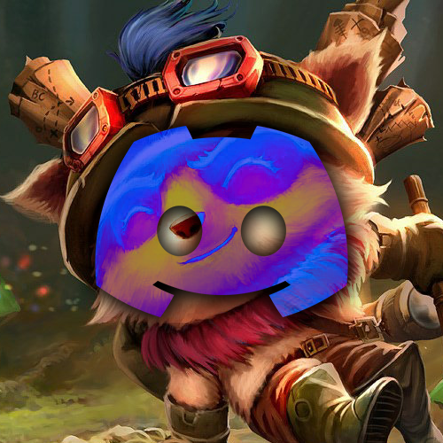

<div align="center">
 
 <h1>LoLBot</h1>
</div>

## About
LoLBot is a Discord bot built upon <a href="https://discord.js.org/">discord.js</a> and the <a href="https://github.com/Sansossio/twisted">Twisted</a> wrapper for Riot API. It offers commands to view stats and information about a League of Legends player. *TFT support is not avaliable right now*

## Commands
`/rank summoner_name: XXX region: XXX` - Get the current ranked season of the  requested player
<br /><br />
`/profile summoner_name: XXX region: XXX` - Get the profile information of the requested player
<br /><br />
`/top_mastery summoner_name: XXX region: XXX` - Get the top five mastery champions for the requested player (if the player has only played less than five champs, it will return the number of champions played)
<br /><br />
`/current_match summoner_name: XXX region: XXX` - Get the current match information of the given player (returns nothing if the player isn't in a **PUBLIC** match)

If the player doesn't exist, in general or in the requested region, LoLBot will return an error.

# Running LoLBot with NodeJS
1. Clone this repository: `git clone https://github.com/Camerxxn/LOLBot.git`
2. Navigate to `./bot` and create a new file called `.env`
3. Create a discord bot (<a href="https://discordjs.guide/preparations/setting-up-a-bot-application.html">tutorial</a>)
4. Get the bot token (**don't share it with anyone**)
5. Get the bot client ID
6. Get a Riot API key <a href="https://developer.riotgames.com/">here</a> (these reset every so often if you don't have a registered application)
7. Edit the `.env` file, it should look like this
```
BOT_TOKEN=YOUR_TOKEN
BOT_CLIENT_ID=YOUR_CLIENT_ID
RIOT_API_KEY=YOUR_API_KEY
```
8. Run `npm install` (this installs the dependencies for the project)
9. Run `npm run build`
10. Finally, `npm run start`
11. Your bot should be setup :)

## Optional Frontend
1. Navigate to `./frontend`
2. Create a `.env` file
3. Get your discord bot client ID and paste it into the `.env` file
```
DISCORD_INVITE=https://discord.com/api/oauth2/authorize?client_id=[YOUR_CLIENT_ID_HERE]&permissions=277025482816&scope=bot
```
4. Run `npm i`
5. Run `npm run build`
6. Run `npm run start`

# Running LoLBot with Docker
1. Have docker on your machine
2. Follow steps 1-7 from <a href="#running-lolbot-with-nodejs">Here</a>
3. Follow steps 1-3 from <a href="#optional-frontend">Here</a>
4. Run `docker compose up`